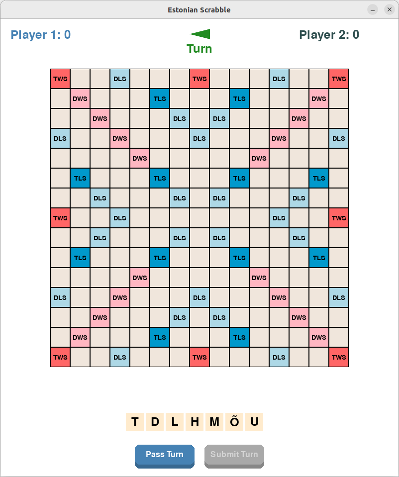
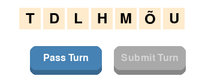
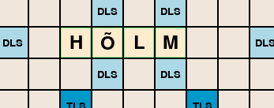
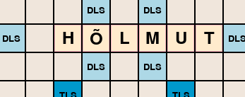
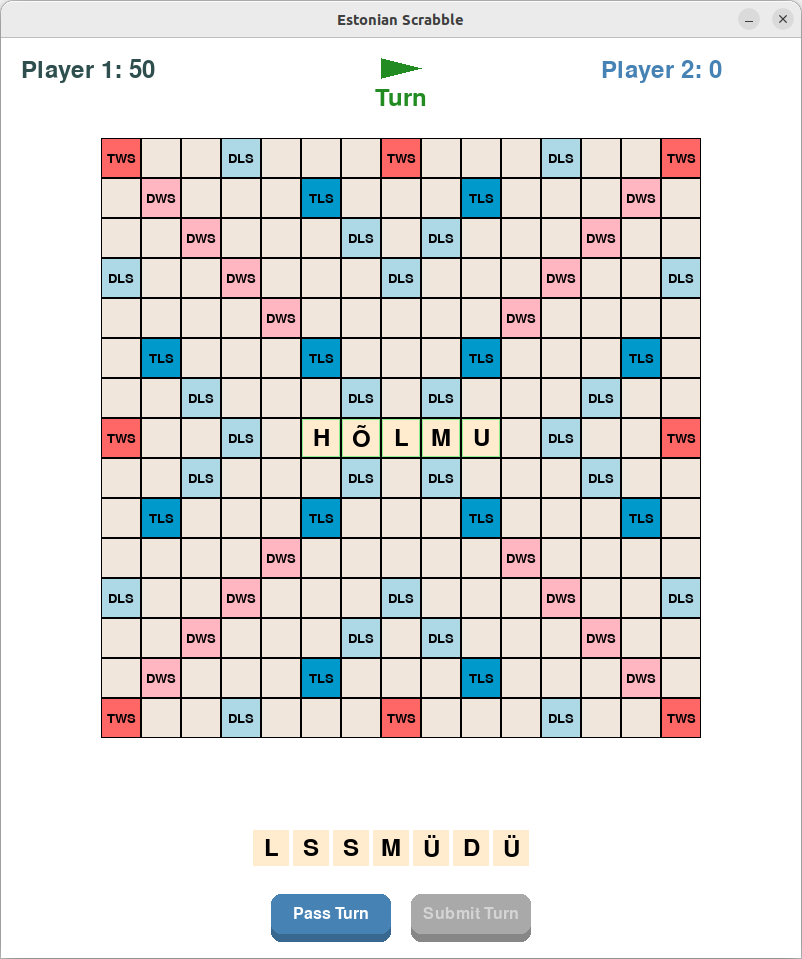
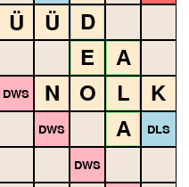

# Eesti Scrabble

Eestikeelne Scrabble mitmekesi veebis mängimiseks. Toetab eesti keele eritähti (õ, ä, ö, ü, š, ž) ja kasutab Hunspelli sõnastikku morfoloogiliseks sõnade kontrolliks.

**Mängi kohe**: [klauseduard.duckdns.org/scrabble](https://klauseduard.duckdns.org/scrabble/)

> **Märkus**: See projekt loodi algselt tehisintellekti abil (Cursor IDE + Claude) 2025. aastal. Veebipõhine mitmikmängu versioon loodi Claude Code'iga 2026. aastal.

## Eeldused

Enne alustamist veenduge, et teil on installitud:

1. **Python 3.8 või uuem**
   - Windows: Laadige alla ja installige [python.org](https://www.python.org/downloads/)
   - Linux: Tavaliselt eelinstallitud, või installige paketihalduri kaudu:
     ```bash
     sudo apt-get install python3  # Ubuntu/Debian jaoks
     sudo dnf install python3      # Fedora jaoks
     ```
   - macOS: Installige [Homebrew](https://brew.sh/) kaudu:
     ```bash
     brew install python3
     ```

2. **pip** (Pythoni paketihaldur)
   - Tavaliselt tuleb kaasa Pythoni installatsiooniga
   - Kontrollimiseks avage terminal/käsurida ja käivitage:
     ```bash
     pip --version  # või pip3 --version
     ```

## Installeerimine

1. **Laadige mäng alla**
   - Laadige see repositoorium alla ZIP-failina ja pakkige lahti
   - Või kui olete tuttav git-iga:
     ```bash
     git clone https://github.com/klauseduard/estonian-scrabble.git
     cd estonian-scrabble
     ```

2. **Avage Terminal/Käsurida**
   - Windows: Vajutage Win+R, sisestage `cmd`, vajutage Enter
   - macOS: Vajutage Cmd+Space, sisestage `terminal`, vajutage Enter
   - Linux: Vajutage Ctrl+Alt+T

3. **Liikuge mängu kausta**
   ```bash
   cd path/to/scrabble  # Asendage tegeliku teega
   ```

4. **Installige sõltuvused**
   ```bash
   pip install -r requirements.txt  # või pip3 install -r requirements.txt
   ```

5. **Käivitage mäng**
   ```bash
   python main.py  # või python3 main.py
   ```

## Kuidas mängida

1. **Mängu alustamine**
   - Käivitage mäng ülaltoodud käsuga
   - Valige mängijate arv (2-4) ja sisestage mängijate nimed
   - Avaneb mänguaken tühja mängulauaga

2. **Mängu juhtimine**
   - **Hiire juhtimine:**
     - Vajutage ja hoidke vasakut hiireklahvi, et lohistada tähti oma restilt lauale
     - Vabastage vasak hiireklahv tähe asetamiseks
     - Paremklõpsake laual olevat tähte, et see tagasi restile tuua
     - Vasakklõpsake nuppe ("Kinnita käik", "Jäta vahele") toimingute sooritamiseks
     - Lohistage tähti restil nende järjekorra muutmiseks
   - Klõpsake "Kinnita käik", kui olete oma sõna asetamisega rahul
   - Klõpsake "Jäta vahele" käigu vahele jätmiseks

3. **Esimene käik**
   - Tähed tuleb asetada läbi keskvälja
   - Peab moodustama korrektse eestikeelse sõna
   - Sõna peab olema loetav vasakult paremale või ülevalt alla

4. **Järgnevad käigud**
   - Uued tähed peavad ühenduma olemasolevate sõnadega
   - Kõik moodustatud sõnad peavad olema korrektsed eestikeelsed sõnad
   - Sõnad loetakse vasakult paremale või ülevalt alla

## Ekraanipildid

> *Märkus: Ekraanipildid näitavad mängu varasemat versiooni. Praegune versioon sisaldab mängijate arvu valikut (2-4), nimede sisestamist, käiguvahetuse ekraani ja muid täiendusi.*

### Mängu liides

*Algne mängulaud preemiumruutudega*


*Mängija täherida ja juhtnupud*

### Sõnade asetamine

*Näide korrektsest sõna asetamisest (roheline esiletõst)*


*Näide vigasest sõna asetamisest (punane esiletõst)*

### Mängu kulg

*Korrektne esimene käik läbi keskvälja*


*Mitme korrektse sõna moodustamine ühe käiguga*

## Veaotsing

### Levinud probleemid

1. **"Python not found" või sarnane viga**
   - Veenduge, et Python on installitud ja lisatud PATH-i
   - Proovige kasutada `python3` `python` asemel
   - Taaskäivitage terminal/käsurida

2. **"pip not found" viga**
   - Veenduge, et pip on installitud
   - Proovige kasutada `pip3` `pip` asemel
   - Windowsis proovige: `py -m pip install -r requirements.txt`

3. **Mäng ei käivitu**
   - Veenduge, et kõik sõltuvused on installitud
   - Proovige sõltuvused uuesti installida:
     ```bash
     pip uninstall -r requirements.txt
     pip install -r requirements.txt
     ```

4. **Eesti tähed ei kuva korrektselt**
   - Veenduge, et teie süsteem toetab UTF-8
   - Proovige uuendada terminali/käsurea fonti

### Abi saamine

Probleemide korral:
1. Kontrollige ülaltoodud veaotsingu sektsiooni
2. Otsige sarnaseid probleeme projekti probleemide haldussüsteemist
3. Looge uus probleem, lisades:
   - Teie operatsioonisüsteem
   - Pythoni versioon (`python --version`)
   - Veateade (kui on)
   - Probleemi taasesitamise sammud

## Funktsioonid

- Täielik eesti tähestiku tugi, sealhulgas õ, ä, ö, ü, š, ž
- Visuaalne tagasiside korrektsete/vigaste sõnade asetamisel
- Tähtede lohistamine ja asetamine
- Reaalajas sõnade valideerimine
- Preemiumruutude punktisüsteem
- 2-4 mängija tugi

## Projekti struktuur

```
├── game/                   # Mängu loogika ja oleku haldamine
│   ├── __init__.py        # Paketi eksport
│   ├── constants.py       # Mängu konstandid (tähtede jaotus, preemiumruudud)
│   ├── state.py           # Põhiline mängu oleku haldamine
│   └── word_validator.py  # Sõnade valideerimise loogika
├── ui/                    # Kasutajaliidese komponendid
│   ├── __init__.py        # Paketi eksport
│   ├── components.py      # UI komponendid (Laud, Täht, Rest, Punktinäit)
│   └── language.py        # Keelehaldur eesti/inglise keele vahetuseks
├── tests/                 # Ühiktestid
│   ├── test_game_state.py
│   └── test_word_validator.py
├── docs/                  # Lisadokumentatsioon
├── main.py                # Mängu põhiprogramm
├── wordlist.py            # Hunspelli sõnastiku integratsioon (spylls)
├── requirements.txt       # Pythoni sõltuvused
└── README.md              # Dokumentatsioon
```

## Mängureeglid

- Mäng järgib standardseid Scrabble'i reegleid kohandustega eesti tähestiku jaoks
- Toetab eesti eritähti (õ, ä, ö, ü, š, ž)
- Kasutab eesti sõnastikku sõnade valideerimiseks
- Preemiumruudud järgivad standardset Scrabble'i laua paigutust

## Arendus

### Arhitektuur

Projekt järgib modulaarset arhitektuuri selge vastutuse jaotusega:

1. **Mängu loogika (`game/`):**
   - `state.py`: Haldab mängu olekut, mängijate käike ja tähtede asetamist
   - `word_validator.py`: Tegeleb sõnade valideerimise ja punktide arvestamisega
   - `constants.py`: Sisaldab mängu konstante ja seadistusi

2. **Kasutajaliides (`ui/`):**
   - `components.py`: Taaskasutatavad UI komponendid
   - Tegeleb kasutaja sisendi ja visuaalse tagasisidega

### Uute funktsioonide lisamine

Uute funktsioonide lisamisel:

1. Määrake, milline moodul peaks uut koodi sisaldama
2. Uuendage asjakohaseid teste (kui need lisame)
3. Järgige olemasolevat koodistiili
4. Uuendage dokumentatsiooni

### Koodistiil

- Kasutage tüübivihjeid funktsioonide parameetrite ja tagastusväärtuste jaoks
- Järgige PEP 8 juhiseid
- Kirjutage docstring'id klassidele ja funktsioonidele
- Hoidke funktsioonid fokuseeritud ja ühe eesmärgiga

## Panustamine

1. Tehke repositooriumist fork
2. Looge funktsiooni haru
3. Tehke oma muudatused
4. Esitage pull request

## Tulevased täiendused

> _Märkus: Järgnevad täiendused pakkus välja tehisintellekti agent arenduse käigus. Inimesest arendaja keskendus peamiselt põhilise mängu tööle saamisele! Tundke end vabalt neid funktsioone implementeerida, kui olete huvitatud._

✅ Implementeeritud:
- Eesti Hunspelli sõnastik morfoloogilise valideerimisega (spylls)
- Punktisüsteem preemiumruutude ja 50-punktilise bingoboonusega
- Reaalajas sõnade valideerimine ja punktide eelvaade
- 2-4 mängija tugi nimede sisestamise ekraaniga
- Tühjade klotside tugi tähevaliku dialoogiga
- Käiguvahetuse ekraan mängijate vahel
- Mängu lõpu ekraan punktide jaotusega
- Eesti/inglise keelevahetuse nupp
- Resti ümberjärjestamine lohistamisega
- Tähtede vahetamine (mänguloogika olemas, UI nupp puudub)
- Ühiktestid mängu oleku ja sõnade valideerimise jaoks
- Logimissüsteem

🚀 Ideed edasiseks arenduseks:
1. **Mängu funktsioonid**:
   - Tähtede vahetamise UI nupp
   - Mängu oleku salvestamine/laadimine
   - Käikude tagasivõtmine/uuesti tegemine
   - Turniirirežiim ajalimiitidega
   - Statistika jälgimine (kõrgeimad punktid, pikimad sõnad jne)

2. **Mitmikmäng**:
   - Võrgu kaudu mängimise tugi
   - Mängijate edetabel

3. **Tehisintellekti funktsioonid**:
   - Tehisintellekti vastane reguleeritava raskusastmega
   - Tehisintellekti käigusoovitused õppimiseks

4. **Kasutajaliidese täiendused**:
   - Animatsioonid tähtede asetamisel
   - Heliefektid
   - Tumeda/heleda teema tugi
   - Ligipääsetavuse funktsioonid

5. **Tehnilised täiendused**:
   - Seadistatavad mängureeglid
   - Platvormideülene pakkimine

## Litsents

See projekt on avatud lähtekoodiga ja saadaval MIT litsentsi all. 