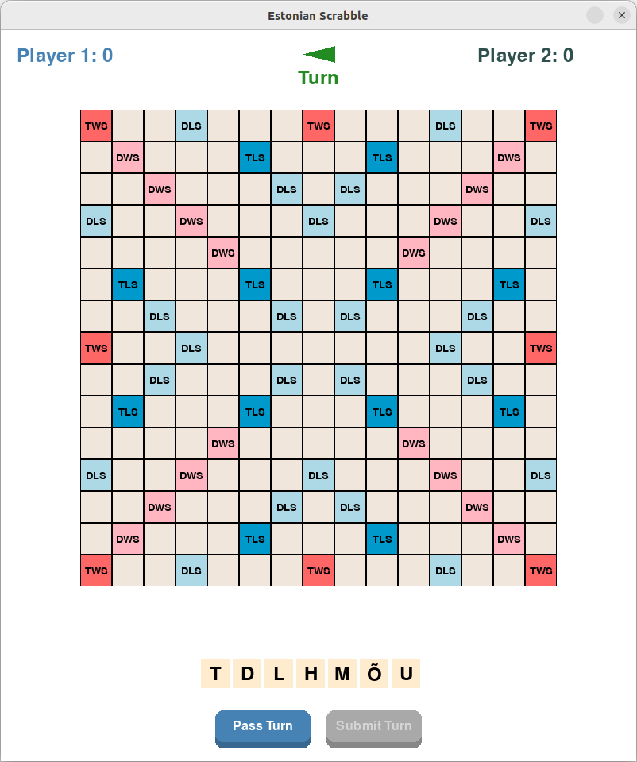
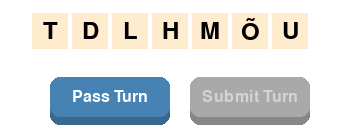
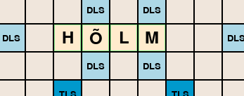
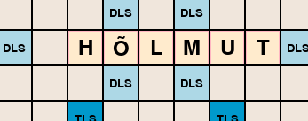
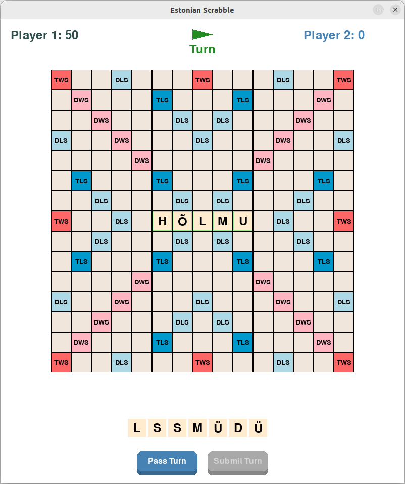
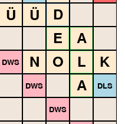

# Estonian Scrabble

A Scrabble game implementation that supports Estonian alphabet and uses Estonian wordlist.

## Prerequisites

Before you begin, ensure you have the following installed:

1. **Python 3.8 or higher**
   - Windows: Download and install from [python.org](https://www.python.org/downloads/)
   - Linux: Usually pre-installed, or install via package manager:
     ```bash
     sudo apt-get install python3  # For Ubuntu/Debian
     sudo dnf install python3      # For Fedora
     ```
   - macOS: Install via [Homebrew](https://brew.sh/):
     ```bash
     brew install python3
     ```

2. **pip** (Python package installer)
   - Usually comes with Python installation
   - To verify, open terminal/command prompt and run:
     ```bash
     pip --version  # or pip3 --version
     ```

## Installation

1. **Download the Game**
   - Download this repository as a ZIP file and extract it
   - Or if you're familiar with git:
     ```bash
     git clone [repository-url]
     cd scrabble
     ```

2. **Open Terminal/Command Prompt**
   - Windows: Press Win+R, type `cmd`, press Enter
   - macOS: Press Cmd+Space, type `terminal`, press Enter
   - Linux: Press Ctrl+Alt+T

3. **Navigate to Game Directory**
   ```bash
   cd path/to/scrabble  # Replace with actual path
   ```

4. **Install Dependencies**
   ```bash
   pip install -r requirements.txt  # or pip3 install -r requirements.txt
   ```

5. **Run the Game**
   ```bash
   python main.py  # or python3 main.py
   ```

## How to Play

1. **Starting the Game**
   - Run the game using the command above
   - The game window will open with an empty board
   - Two players take turns

2. **Game Controls**
   - Drag and drop tiles from your rack to the board
   - Right-click a tile to remove it from the board
   - Click "Commit" to end your turn
   - Click "Pass" to skip your turn
   - Click "Exchange" to swap tiles (counts as your turn)

3. **First Move**
   - Must place tiles through the center square
   - Must form a valid Estonian word
   - Word must read left-to-right or top-to-bottom

4. **Subsequent Moves**
   - New tiles must connect to existing words
   - All formed words must be valid Estonian words
   - Words read left-to-right or top-to-bottom

## Screenshots

### Game Interface

*Initial game board showing premium squares*


*Player's tile rack and game controls*

### Word Placement

*Example of a valid word placement (green highlight)*


*Example of an invalid word placement (red highlight)*

### Game Progress

*Valid first move through the center square*


*Forming multiple valid words in one move*

## Troubleshooting

### Common Issues

1. **"Python not found" or similar error**
   - Make sure Python is installed and added to PATH
   - Try using `python3` instead of `python`
   - Restart your terminal/command prompt

2. **"pip not found" error**
   - Make sure pip is installed
   - Try using `pip3` instead of `pip`
   - On Windows, try: `py -m pip install -r requirements.txt`

3. **Game doesn't start**
   - Make sure all dependencies are installed
   - Try reinstalling dependencies:
     ```bash
     pip uninstall -r requirements.txt
     pip install -r requirements.txt
     ```

4. **Estonian characters don't display correctly**
   - Make sure your system supports UTF-8
   - Try updating your terminal/command prompt font

### Getting Help

If you encounter any issues:
1. Check the troubleshooting section above
2. Look for similar issues in the project's issue tracker
3. Create a new issue with:
   - Your operating system
   - Python version (`python --version`)
   - Error message (if any)
   - Steps to reproduce the problem

## Features

- Full Estonian alphabet support including õ, ä, ö, ü, š, ž
- Visual feedback for valid/invalid word placements
- Drag-and-drop tile placement
- Real-time word validation
- Premium square scoring system
- Support for two players

## Project Structure

```
scrabble/
├── game/                   # Game logic and state management
│   ├── __init__.py        # Package exports
│   ├── constants.py       # Game constants (letter distribution, premium squares)
│   ├── state.py          # Core game state management
│   └── word_validator.py  # Word validation logic
├── ui/                    # User interface components
│   ├── __init__.py       # Package exports
│   └── components.py     # UI components (Board, Tile, Rack)
├── main.py               # Main game entry point
├── requirements.txt      # Python dependencies
└── README.md            # This file
```

## Game Rules

- The game follows standard Scrabble rules with adaptations for Estonian alphabet
- Supports Estonian special characters (õ, ä, ö, ü, š, ž)
- Uses Estonian wordlist for word validation
- Premium squares follow standard Scrabble board layout

## Development

### Architecture

The project follows a modular architecture with clear separation of concerns:

1. **Game Logic (`game/`):**
   - `state.py`: Manages game state, player turns, and tile placement
   - `word_validator.py`: Handles word validation and scoring
   - `constants.py`: Contains game constants and configuration

2. **User Interface (`ui/`):**
   - `components.py`: Reusable UI components
   - Handles user input and visual feedback

### Adding New Features

When adding new features:

1. Determine which module should contain the new code
2. Update relevant tests (when we add them)
3. Follow the existing code style
4. Update documentation

### Code Style

- Use type hints for function parameters and return values
- Follow PEP 8 guidelines
- Write docstrings for classes and functions
- Keep functions focused and single-purpose

## Contributing

1. Fork the repository
2. Create a feature branch
3. Make your changes
4. Submit a pull request

## Future Improvements

- [ ] Add proper Estonian wordlist source
- [ ] Implement scoring system
- [ ] Add game save/load functionality
- [ ] Add network multiplayer support
- [ ] Add unit tests
- [ ] Add AI opponent

## License

This project is open source and available under the MIT License. 