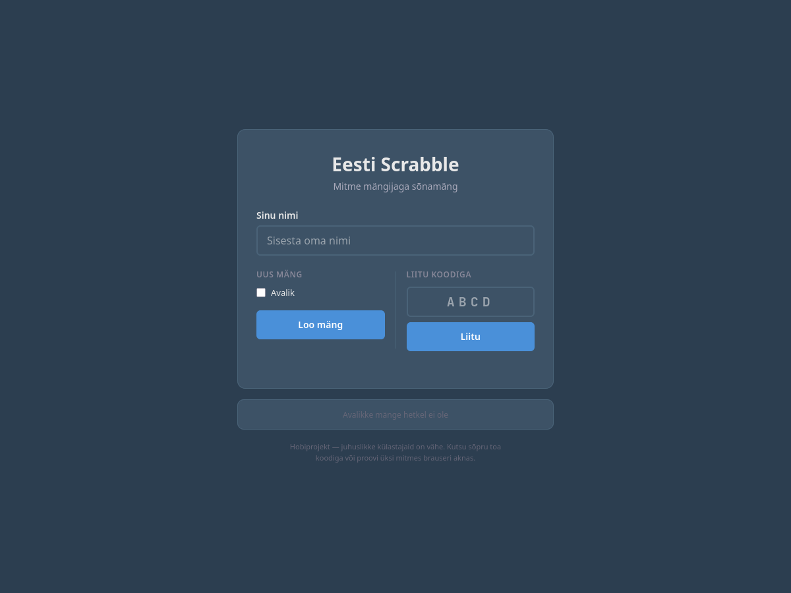
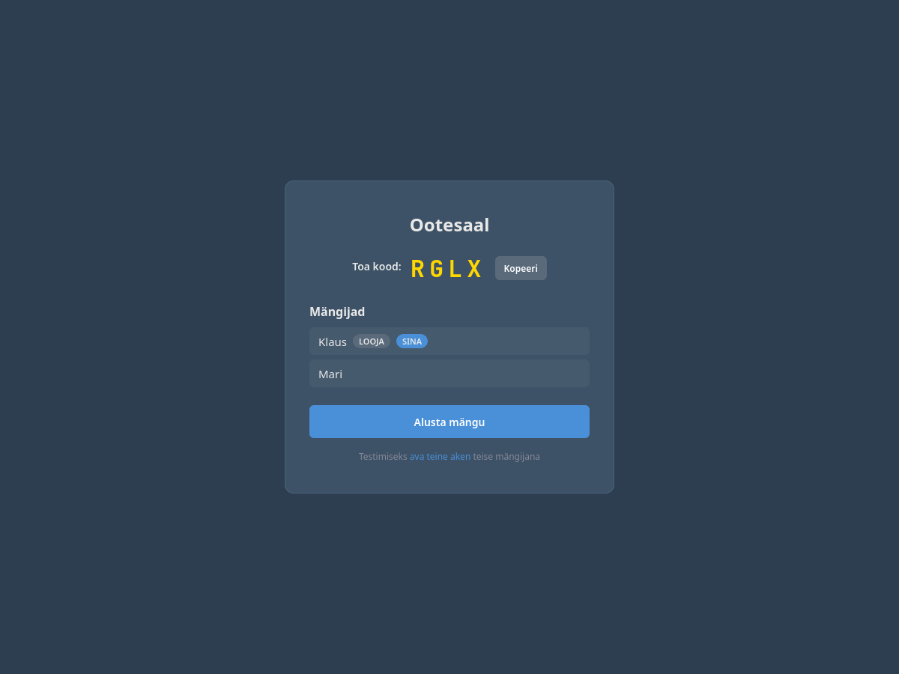
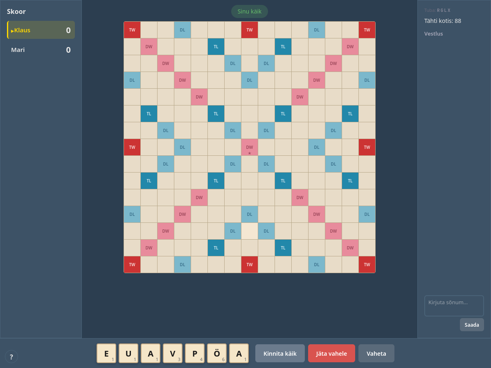
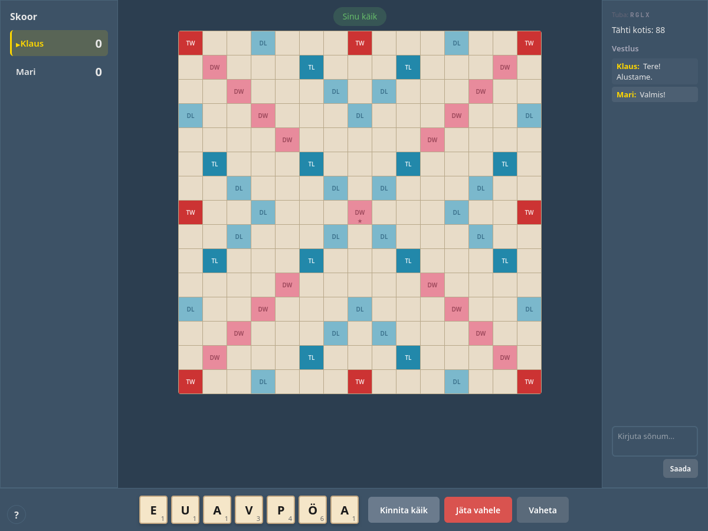

# Estonian Scrabble

[](https://opensource.org/licenses/MIT)
[](https://www.python.org/downloads/)
[](https://en.wikipedia.org/wiki/Estonian_language)

> **Note**: This project was originally bootstrapped using AI-assisted programming (Cursor IDE + Claude) in 2025. The web multiplayer version was built with Claude Code in 2026.

A Scrabble board game for the Estonian language with web-based multiplayer. Play with friends online — no installation or registration needed. Supports Estonian special characters (õ, ä, ö, ü, š, ž) with full morphological word validation via Hunspell.

**Play now**: [klauseduard.duckdns.org/scrabble](https://klauseduard.duckdns.org/scrabble/)

**Keywords**: scrabble, estonian language, word game, multiplayer, web game, python, fastapi, websocket

> [🇪🇪 Eestikeelne dokumentatsioon (README in Estonian)](README.et.md)

## Prerequisites

Before you begin, ensure you have the following installed:

1. **Python 3.8 or higher**
   - Windows: Download and install from [python.org](https://www.python.org/downloads/)
   - Linux: Usually pre-installed, or install via package manager:
     ```bash
     sudo apt-get install python3  # For Ubuntu/Debian
     sudo dnf install python3      # For Fedora
     ```
   - macOS: Install via [Homebrew](https://brew.sh/):
     ```bash
     brew install python3
     ```

2. **pip** (Python package installer)
   - Usually comes with Python installation
   - To verify, open terminal/command prompt and run:
     ```bash
     pip --version  # or pip3 --version
     ```

## Installation

1. **Download the Game**
   - Download this repository as a ZIP file and extract it
   - Or if you're familiar with git:
     ```bash
     git clone https://github.com/klauseduard/estonian-scrabble.git
     cd estonian-scrabble
     ```

2. **Open Terminal/Command Prompt**
   - Windows: Press Win+R, type `cmd`, press Enter
   - macOS: Press Cmd+Space, type `terminal`, press Enter
   - Linux: Press Ctrl+Alt+T

3. **Navigate to Game Directory**
   ```bash
   cd path/to/scrabble  # Replace with actual path
   ```

4. **Install Dependencies**
   ```bash
   pip install -r requirements.txt  # or pip3 install -r requirements.txt
   ```

5. **Run the Game**
   ```bash
   python main.py  # or python3 main.py
   ```

## Web Version

The game includes a web-based multiplayer mode using WebSockets.

### Run locally

```bash
pip install -r requirements-server.txt
uvicorn server.app:app
```

Then open http://localhost:8000 in your browser.

### Run with Docker

```bash
docker compose up --build
```

Then open http://localhost:8080 in your browser.

### Deployment

**Fly.io** (free tier available):

```bash
fly launch          # first time
fly deploy          # subsequent deploys
```

**Railway**: connect your GitHub repo and Railway will auto-detect the Dockerfile.

**Quick sharing with ngrok**:

```bash
uvicorn server.app:app --port 8080
ngrok http 8080
```

Share the ngrok URL with friends to play remotely.

## Features

- **2-4 players** on separate devices via WebSocket
- **Real-time** board updates, score preview, turn notifications
- **In-game chat** with system messages for moves and challenges
- **Word challenge** — dispute any move, ask the player to take it back
- **Force submit** ("Palu heakskiitu") — play words not in the dictionary if all players approve
- **Reconnection** — rejoin a game if your browser crashes
- **Rack reordering** — drag tiles to rearrange your rack
- **Tile exchange** — swap tiles with the bag
- **Public lobby** — find open games or create your own
- **Estonian UI** — full Estonian interface

## Screenshots

### Web Version


*Lobby — create a new game or join with a room code*


*Waiting room — share the room code with friends*


*Game board with scores, tile rack, and chat*


*In-game chat with system move notifications*

### Desktop Version (Pygame)

> *Screenshots show the Pygame desktop version, which is still available.*


*Desktop game board with premium squares*


*Valid word placement (green highlight)*

## How to Play

### Web Version
1. Open the game at [klauseduard.duckdns.org/scrabble](https://klauseduard.duckdns.org/scrabble/)
2. Enter your name and create a new game or join with a room code
3. Share the 4-letter room code with friends
4. Click or drag tiles from your rack to the board
5. Right-click (or tap) placed tiles to return them to your rack
6. Click **Kinnita käik** to submit your word
7. If the dictionary rejects your word, click **Palu heakskiitu** to ask other players

### Desktop Version (Pygame)
1. Run `python main.py`
2. Select number of players (2-4) and enter names
3. Drag tiles from rack to board, right-click to remove
4. Click "Submit Turn" or "Pass Turn"

## Troubleshooting

- **Web version**: Works in any modern browser. If WebSocket connection fails, check that your network doesn't block WebSocket traffic.
- **Desktop version**: Requires Python 3.8+ and Pygame. Run `pip install -r requirements.txt` to install dependencies.
- **Estonian characters**: The web version handles all Estonian characters. For the desktop version, ensure your system supports UTF-8.

### Getting Help

Report bugs or suggest features: [GitHub Issues](https://github.com/klauseduard/estonian-scrabble/issues) or email klaus.eduard@gmail.com

## Features

- Full Estonian alphabet support including õ, ä, ö, ü, š, ž
- Visual feedback for valid/invalid word placements
- Drag-and-drop tile placement
- Real-time word validation
- Premium square scoring system
- Support for 2-4 players

## Project Structure

```
├── game/                   # Game logic and state management
│   ├── __init__.py        # Package exports
│   ├── constants.py       # Game constants (letter distribution, premium squares)
│   ├── state.py           # Core game state management
│   └── word_validator.py  # Word validation logic
├── ui/                    # User interface components
│   ├── __init__.py        # Package exports
│   ├── components.py      # UI components (Board, Tile, Rack, ScoreDisplay)
│   └── language.py        # LanguageManager for Estonian/English i18n
├── tests/                 # Unit tests
│   ├── test_game_state.py
│   └── test_word_validator.py
├── docs/                  # Additional documentation
├── main.py                # Main game entry point
├── wordlist.py            # Hunspell dictionary integration (spylls)
├── requirements.txt       # Python dependencies
└── README.md              # This file
```

## Game Rules

- The game follows standard Scrabble rules with adaptations for Estonian alphabet
- Supports Estonian special characters (õ, ä, ö, ü, š, ž)
- Uses Estonian wordlist for word validation
- Premium squares follow standard Scrabble board layout

## Development

### Architecture

The project follows a modular architecture with clear separation of concerns:

1. **Game Logic (`game/`):**
   - `state.py`: Manages game state, player turns, and tile placement
   - `word_validator.py`: Handles word validation and scoring
   - `constants.py`: Contains game constants and configuration

2. **User Interface (`ui/`):**
   - `components.py`: Reusable UI components
   - Handles user input and visual feedback

### Running Tests

The project includes automated tests to verify game logic and behavior:

```bash
# Run all tests
python3 -m unittest discover tests

# Run specific test file
python3 -m unittest tests/test_word_validator.py

# Run tests with verbose output
python3 -m unittest -v tests/test_word_validator.py
```

Key test areas:
- Word validation and scoring
- Tile placement rules
- Game state management

### Adding New Features

When adding new features:

1. Determine which module should contain the new code
2. Add appropriate tests
3. Follow the existing code style
4. Update documentation

### Code Style

- Use type hints for function parameters and return values
- Follow PEP 8 guidelines
- Write docstrings for classes and functions
- Keep functions focused and single-purpose

## Contributing

1. Fork the repository
2. Create a feature branch
3. Make your changes
4. Submit a pull request

## Future Ideas

- AI opponent with adjustable difficulty
- Statistics tracking (highest scores, longest words)
- Save/resume games across server restarts
- Improved word validation (spylls has [known false positives](https://github.com/klauseduard/estonian-scrabble/issues/32))

## License

This project is open source and available under the MIT License. 