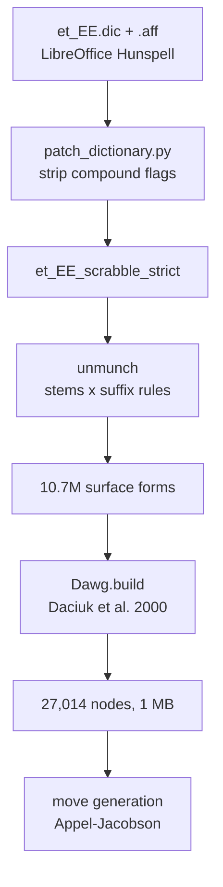
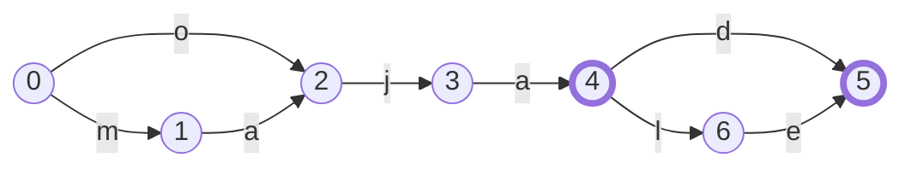

# Algorithms

Three parts of this project are more than plumbing. The first turns a Hunspell
dictionary into a flat list of 10.7 million words. The second packs that list
into a one-megabyte graph. The third uses that graph to find every legal
Scrabble move in under 50 milliseconds.

They form one pipeline, and each stage exists to make the next one possible.
Read them in order.



Every figure below was measured on the files in `dict/`. Regenerate them with:

```bash
python -m tools.algorithm_figures
```

That command prints the DAWG statistics and the small example. Add `--full` to
re-run the dictionary expansion as well, which takes about 30 seconds. If the
dictionary changes, run it and update the numbers here.

---

## 1. From a Hunspell dictionary to a word list

### What Hunspell is

**Hunspell** is the spell checker built into LibreOffice, Firefox and Thunderbird.
Its dictionary format is the usual one for open-source spell checking.
Estonian has an official dictionary in that format, maintained by the
[Institute of the Estonian Language](https://www.eki.ee/) and shipped with
LibreOffice. This project uses it rather than a word list of its own.

Hunspell itself is a C++ library. This project reads the format with
[spylls](https://spylls.readthedocs.io/), which reimplements Hunspell in pure
Python. That avoids a native dependency, and it also makes the internals
readable, which matters here because the pipeline needs to reach inside the
format rather than only ask it questions.

A Hunspell dictionary is two files. The `.dic` file lists word stems, one per
line, each followed by the flags that stem carries. The `.aff` file says what
those flags mean.

Estonian consonant gradation and vowel alternation mean that one stem cannot
generate every form, so the dictionary lists more than one stem per word. These
are two of the entries for *maja*, meaning house:

```
maja/Z
majaga/Zabcfhiky
```

The first is the nominative and carries only `Z`, the compound flag. The second
is the comitative, *majaga*, meaning with a house, and it carries eight more
flags. Those flags are where the inflected forms come from. Each names a group
of suffix rules in the `.aff` file, and each rule has a condition, some letters
to strip, and some letters to add:

```
flag b: when the stem ends in "aga", strip "ga", add "d"     -> majad
flag f: when the stem ends in "aga", strip "ga", add "le"    -> majale
flag h: when the stem ends in "aga" or "uga", strip "ga",
        add "deta"                                           -> majadeta
```

So *majad* is never stored. It is produced on demand from the stem *majaga* by
rule group `b`. The Estonian dictionary holds 282,173 stem entries, and its
`.aff` file holds 26 rule groups, named `a` to `z`, containing 9,249 rules
between them. Those cover millions of forms.

### What the flag letters mean

The mechanism is part of Hunspell, and every dictionary in the format uses it.
A stem carries flags, and the `.aff` file says what each flag does.

The letters themselves are not. Each dictionary picks its own, and they mean
nothing outside it. In `et_EE.aff`, flag `b` names the group that strips `ga`
and adds `d`. In a German or Polish dictionary the same letter names whatever
that author needed. There is no shared registry, and no meaning to look up.

Their form is also a per-dictionary choice. A `FLAG` directive can make flags
two characters, or numbers, or UTF-8 characters. Estonian declares no `FLAG`
directive, so it takes the default of one character per flag, which is why
these are single letters.

A few directives do bind a letter to behaviour that Hunspell itself
implements. `COMPOUNDFLAG Z` tells Hunspell that a stem carrying `Z` may be
joined to another such stem. The directive name is fixed and the letter is
not: the Estonian author chose `Z`, and `tools/patch_dictionary.py` reads the
directive rather than assuming the letter.

This project invents no flags. It removes `Z` from vowelless entries, and when
`data/extra_words.txt` adds a missing word, the patch copies the flags of an
existing model word that inflects the same way.

### The problem

Estonian inflects heavily, as the example above shows. Storing every form
separately would be enormous, which is why Hunspell stores stems and rules
instead and reconstructs a form when asked about it.

That design is wrong for move generation. To search for moves we walk the board
letter by letter, and at each letter we need one answer: can this prefix still
become a word? Hunspell cannot answer that question. It validates whole words
only.

So we expand the dictionary once, before the game runs. Take every stem, apply
every rule that the stem carries, and write down all the results. The Hunspell
community calls this *unmunching*.

### The expansion

`tools/build_dawg.py::unmunch_strict_dictionary` does the work. At its centre
is a double loop over every stem and every flag on that stem.

One detail is worth copying. A single flag can carry hundreds of subrules, and
those subrules share a small number of conditions. Testing each subrule
separately would test the same condition hundreds of times per stem, so the
code groups the subrules by condition first:

```python
# Group each flag's suffix rules by condition so each distinct
# condition regex is tested once per stem, not once per subrule.
cond_groups = {}
for flag, suffixes in d.aff.SFX.items():
    by_cond = {}
    for sfx in suffixes:
        by_cond.setdefault(sfx.condition, []).append((sfx.strip, sfx.add))
```

This is the difference between the step taking seconds and taking minutes.

The result is 10,749,582 surface forms.

### Why a second, stricter dictionary exists

Hunspell can also glue words together. Any word carrying the compound flag may
be joined to another such word, and the result validates. Estonian compounds
freely, so the upstream dictionary uses this feature heavily.

For Scrabble the feature is harmful. The upstream `et_EE.aff` declares:

```
COMPOUNDFLAG Z
COMPOUNDMIN 2
```

`COMPOUNDMIN 2` allows a part as short as two letters. In `et_EE.dic`, 118
vowelless entries carry that `Z` flag. They are the abbreviations and acronyms:
`tk`, `lk`, `CD`, `DVD`. Put those two rules together and `tk` plus `öis`
validates as `tköis`, which no player would defend.

Count those entries with a decoder rather than a byte-level grep. The `.dic`
file is ISO8859-15, so a UTF-8 pattern for `õäöü` matches nothing and reports
words that do contain vowels as vowelless.

A human never finds these seams. A program that permutes tiles finds little
else. When the AI was first added, roughly two thirds of the moves that
brute-force search produced were garbage of this shape. See
[issue #33](https://github.com/klauseduard/estonian-scrabble/issues/33).

So `tools/patch_dictionary.py` writes two dictionaries instead of one:

| Dictionary | Compounding | Used for |
|---|---|---|
| `et_EE_scrabble` | on, abbreviations de-flagged | validating human moves |
| `et_EE_scrabble_strict` | removed entirely | AI moves, and the DAWG |

The asymmetry is deliberate. If the strict dictionary rejects a real word, the
AI misses one move and nobody notices. If it accepts a fake word, the AI plays
it. False negatives are cheap and false positives are not. Human players get
the permissive dictionary, and the challenge system is their recourse.

This is a data fix rather than an algorithm, but it explains why the pipeline
begins with a patch step. See
[issue #32](https://github.com/klauseduard/estonian-scrabble/issues/32).

---

## 2. The DAWG

### Start with a trie

Take six words: `maja, majad, majale, oja, ojad, ojale`.

A trie stores each word as a path from a root node. Words that begin the same
way share the beginning of their path. Here `maja`, `majad` and `majale` share
their first four nodes, and the three `oja` forms share their first three. But
`oja` shares nothing with `maja`, because they begin with different letters.

That trie has 14 nodes.

### The idea

Look at where those six words end. `maja` and `oja` both end in `ja`. Both can
take `-d`, and both can take `-le`. After you have read `ma` or `o`, the set of
possible continuations is identical.

A trie cannot use that. It merges shared beginnings only. A **DAWG**, or
Directed Acyclic Word Graph, merges shared endings as well. Two nodes that
accept the same set of continuations become one node.



Nodes with thick borders are word endings. Seven nodes now hold what the trie
needed 14 for, and two merge points do all of the work.

Node 2 is reached two ways, by `m` then `a`, and by `o` alone. Whatever follows
is the same either way, so the `ja` path is stored once. Node 5 ends both `-d`
and `-le`, so `majad`, `ojad`, `majale` and `ojale` all finish at the same
place.

That diagram is not drawn by hand. It is what `Dawg.build` produces:

```
node  final  edges
  0         {'m': 1, 'o': 2}
  1         {'a': 2}
  2         {'j': 3}
  3         {'a': 4}
  4    *    {'d': 5, 'l': 6}
  5    *    {}
  6         {'e': 5}
```

### Building it in one pass

`game/dawg.py` uses the incremental algorithm of Daciuk et al. (2000). It
produces the minimal graph directly. There is no separate phase that builds a
trie and then shrinks it.

The algorithm has one requirement: the input words must arrive in alphabetical
order. That requirement is what makes it work.

Consider two words in sequence. They share some prefix, and then they differ.
Everything after that shared prefix belongs to the earlier word alone, and no
later word can reach it, because later words sort after this one. That part of
the graph is therefore finished. Since it will never change again, it can be
merged with an identical part right now.

Two structures carry the state. The `unchecked` stack holds the nodes along the
previous word that might still grow. The `register` dictionary maps a node
signature to the one canonical node with that signature. A signature is
`(is_final, tuple of (char, child))`, so two nodes with equal signatures accept
exactly the same continuations and are interchangeable.

```python
def minimize(down_to: int):
    for _ in range(len(unchecked) - down_to):
        parent, ch, child = unchecked.pop()
        key = child.key()
        existing = register.get(key)
        if existing is not None:
            parent.edges[ch] = existing   # reuse an identical node
        else:
            register[key] = child          # this shape is new
```

### The clever part

Look at how a signature is computed:

```python
def key(self):
    # Children are already minimized (registered), so identity works.
    return (self.final, tuple((ch, id(n)) for ch, n in self.edges.items()))
```

It identifies each child by `id(n)`, which is its memory address. Comparing
addresses normally proves nothing about structure, because two separate objects
can hold identical data.

Here it proves everything, and the reason is the order in which work happens.
Minimisation runs bottom-up, so every child has already passed through the
register before its parent is examined. Any two identical subtrees were
therefore already merged into one object. Identical structure and identical
address have become the same thing.

So a comparison that looks like it must walk two subtrees is one dictionary
lookup on a tuple of integers.

### What it buys

| | |
|---|---|
| Surface forms in | 10,749,582 |
| Nodes out | 27,014 |
| Edges | 94,846 |
| Word-ending nodes | 9,742 |
| Serialized size | 1,006 KB |
| `is_word` | 0.23 µs |

Estonian compresses well here, because its inflection is regular. Millions of
words share a few thousand suffix paths. Written out as plain text, those
10,749,582 forms occupy 140.8 MB. The DAWG holds the same set in 0.98 MB, which
is 143 times smaller.

The finished graph is flattened into two parallel lists, `finals[i]` and
`edges[i]`, rather than kept as linked objects. A lookup is then two list
indexes, and saving the graph is one `marshal` call.

---

## 3. Move generation

Given a board and a rack, find every legal move.

### Why the obvious method fails

The obvious method generates candidate placements and tests each one against
the dictionary. This project did that first, and it fails in two ways. The
number of candidates grows faster than the rack size, so the search needs a
time limit. Once it
has a time limit it stops early, and it misses moves without saying so.

Appel and Jacobson inverted the method in 1988. Instead of generating
candidates and then consulting the dictionary, walk the dictionary and the
board together. A partial word is abandoned the moment it stops being a path in
the DAWG. Nothing invalid is ever built, so nothing needs testing afterwards.

The result is exhaustive, and fast enough that the old 12-second limit is gone:

| Position | Rack | Moves found | Time |
|---|---|---|---|
| Empty board | `MAJAKTS` | 1,036 | 48 ms |
| After one word | `RELVUOI` | 861 | 5 ms |

The rest of this section builds that search up one step at a time.

### Step 1: anchors

A new word must touch what is already on the board. So the only useful squares
are the empty ones next to an occupied one. Those squares are called
**anchors**, and `_get_anchors` collects them. On the first move there is
exactly one anchor, the centre square.

Anchors reduce the search from every square on the board to a handful. The
small board in the next step has ten.

### Step 2: cross-checks

A tile placed in a row can also form a vertical word through that square.
Discovering this at the end would waste the whole search that led there, so the
code works it out first.

For every empty square in the row, `_dawg_cross_checks_for_row` computes which
letters the vertical neighbours allow. Put `MAJA` down column 7 and ask about
the row directly beneath it:

```
       c5 c6 c7 c8 c9
  r6    .  .  m  .  .
  r7    .  .  a  .  .
  r8    .  .  j  .  .
  r9    .  .  a  .  .
  r10   .  .  ?  .  .
```

The function returns this:

```
col 5: unconstrained (no vertical neighbours)
col 6: unconstrained
col 7: 3 letters allowed: d l s
col 8: unconstrained
col 9: unconstrained
```

Only `d`, `l` and `s` fit, because *majad*, *majal* and *majas* are words and
no other single letter completes `maja?`. Any horizontal word crossing that
square is now limited to three letters before the search begins.

Two return values mean different things. `None` means the square has no
vertical neighbours and so accepts anything. An empty set means the square
accepts nothing at all. Treating those two as the same would be a bug.

### Step 3: build left, then extend right

Around each anchor the search runs in two phases, one on each side of it.

```
  column      5     6     7     8     9    10
            +-----+-----+-----+-----+-----+-----+
  board     |     |     |     |  a  |     |     |
            +-----+-----+-----+-----+-----+-----+
                          ^      ^
                          |      +-- tile already played
                          +-- anchor

            <---- left_part ---|--- extend_right --->
             rack tiles only        rack tiles, and any
             into empty squares     tile already on the row
```

Both phases walk the DAWG, and both are recursive.

`left_part` grows a prefix leftward from the anchor, one rack tile at a time.
It only follows edges that the DAWG actually has. It never crosses a tile that
is already on the board, because anything to the left of such a tile is reached
from a different anchor.

`extend_right` then continues from the anchor rightward. Where the board
already holds a tile, the search must follow that letter, as with the `a` in
column 8 above. Where the square is empty, it may place a rack tile, subject to
the cross-checks from step 2. Whenever it stands on a final node, and it has
passed the anchor, it has found a word.

### What the recursion looks like

This is the part that prose alone does not convey, so here is a real trace.
Rack `MAJ`, empty board, anchor at column 7:

```
left_part(word=''       limit=2, anchor_col=7)
    extend_right(word=''       col=7, placed=0)
    extend_right(word='a'      col=8, placed=1)
    extend_right(word='aj'     col=9, placed=2)
    extend_right(word='am'     col=9, placed=2)
    extend_right(word='j'      col=8, placed=1)
    extend_right(word='ja'     col=9, placed=2)
    extend_right(word='jam'    col=10, placed=3)
    extend_right(word='m'      col=8, placed=1)
    extend_right(word='ma'     col=9, placed=2)
    extend_right(word='maj'    col=10, placed=3)
left_part(word='a'      limit=1, anchor_col=7)
    extend_right(word='a'      col=7, placed=1)
    ...
```

Now look at what is absent. There is no `mj`, and no `jm`. Those pairs begin no
Estonian word, so the DAWG has no such edge, and the branch is never created.
The search does not build them and reject them. It never builds them.

The whole search for that rack is 66 recursive calls.

### Step 4: the transposition trick

Everything above finds horizontal words. Vertical words need the same logic
turned 90 degrees, which usually means a second copy of the algorithm with rows
and columns swapped. That is twice the code and twice the places to make a
mistake.

This code instead rotates the board and reuses the scanner:

```python
# Horizontal main words
_dawg_scan_rows(board, rack_counts, dawg, anchors, moves, transposed=False)

# Vertical main words: transpose board and anchor coordinates
tboard = [list(col) for col in zip(*board)]
tanchors = {(c, r) for (r, c) in anchors}
_dawg_scan_rows(tboard, rack_counts, dawg, tanchors, moves, transposed=True)
```

`zip(*board)` transposes the grid. The identical horizontal scanner then runs
over the rotated board. The `transposed` flag exists for one purpose, which is
to tell `record()` which way round to write the coordinates back:

```python
pos = (col, r) if transposed else (r, col)
```

Moves are collected in a dictionary keyed by a `frozenset` of the placed tiles.
A move that both passes find is therefore stored once.

### Blanks

A blank tile can stand for any letter. In a generate-and-test design that
multiplies the search by the size of the alphabet. Here it costs almost
nothing.

At every step the code already loops over the DAWG edges leaving the current
node. Those edges are exactly the letters that can continue a word. A blank
means the player can afford any of them:

```python
for ch, child in edges[node].items():
    if allowed is not None and ch not in allowed:
        continue
    n_real = rack_counts.get(ch, 0)
    n_blank = rack_counts.get("_", 0)
    if n_real:      # play the real tile
        ...
    if n_blank:     # or spend a blank as this letter
        ...
```

Both branches are explored when both are possible, and `placed` records which
one was taken, so scoring can give the blank zero points later.

---

## Where to look in the code

| Concept | Location |
|---|---|
| Unmunching, condition grouping | `tools/build_dawg.py::unmunch_strict_dictionary` |
| Compound-flag patch, strict variant | `tools/patch_dictionary.py` |
| DAWG structure, lookup, serialization | `game/dawg.py::Dawg` |
| Incremental minimisation | `game/dawg.py::Dawg.build` |
| Anchors | `game/ai_player.py::_get_anchors` |
| Cross-checks | `game/ai_player.py::_dawg_cross_checks_for_row` |
| Left-part and extend-right | `game/ai_player.py::_dawg_scan_rows` |
| Transposition | `game/ai_player.py::_find_all_moves_dawg` |
| Scoring and move choice | `game/ai_player.py::_calculate_move_score`, `select_move` |

## References

Daciuk, Mihov, Watson and Watson (2000), *Incremental Construction of Minimal
Acyclic Finite-State Automata*. This is the construction used in `Dawg.build`.

Appel and Jacobson (1988), *The World's Fastest Scrabble Program*, CACM 31(5).
This is the source of anchors, cross-checks, and the left-part and extend-right
search.

[Issue #40](https://github.com/klauseduard/estonian-scrabble/issues/40) records
the change from brute force to DAWG move generation in this project.
