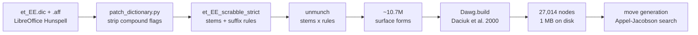
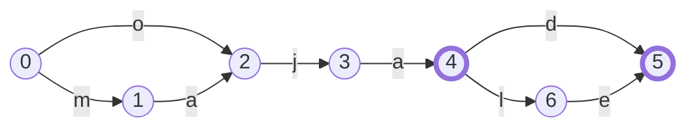
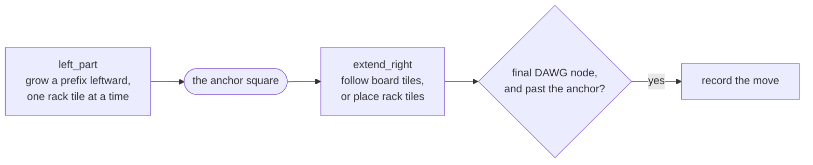

# Algorithms

Three pieces of this project are more than plumbing: turning a Hunspell
dictionary into a flat word list, packing 10.7 million words into a megabyte,
and finding every legal Scrabble move without ever guessing.

They form one pipeline. Each stage exists to make the next one possible.



Every number in this document was measured on the real artifacts in `dict/`,
not taken from a paper. Regenerate them all with:

```bash
python -m tools.algorithm_figures        # DAWG stats and the toy example
python -m tools.algorithm_figures --full # also re-runs the unmunch (~30 s)
```

If the dictionary changes, run that and update the figures here rather than
trusting the prose.

---

## 1. From a Hunspell dictionary to a word list

Estonian is heavily inflected. *Maja* (house) has dozens of forms — *majad*,
*majale*, *majaga*, *majadeta* — and a dictionary that stored them all
separately would be enormous. Hunspell therefore stores **stems** plus **affix
rules**, and reconstructs forms on demand.

That is exactly wrong for move generation. To search for moves we need to walk
letter by letter and ask "can this prefix still become a word?" — a question
Hunspell cannot answer, because it only validates whole words. So we *unmunch*:
expand every stem by every rule it carries, producing the full surface set once,
offline.

`tools/build_dawg.py::unmunch_strict_dictionary` does this. The core is a double
loop — every stem, every flag on it — but with one optimisation worth noting:

```python
# Group each flag's suffix rules by condition so each distinct
# condition regex is tested once per stem, not once per subrule.
cond_groups = {}
for flag, suffixes in d.aff.SFX.items():
    by_cond = {}
    for sfx in suffixes:
        by_cond.setdefault(sfx.condition, []).append((sfx.strip, sfx.add))
```

A flag may carry hundreds of subrules that share a handful of conditions. Testing
the condition once per group instead of once per subrule is the difference
between this step taking seconds and taking minutes.

### Why there is a *strict* dictionary at all

Hunspell supports **compounding**: words flagged as compoundable may be glued
together, and the result validates. Estonian genuinely compounds, so upstream
uses this heavily.

For Scrabble it is a disaster. The upstream `et_EE.aff` declares:

```
COMPOUNDFLAG Z
COMPOUNDMIN 2
```

and 668 vowelless entries in `et_EE.dic` carry that `Z` — every abbreviation and
acronym in the file, from `tk` and `lk` to `CD` and `DVD`. Two-letter minimum
plus compoundable abbreviations means `tk` + `öis` validates as `tköis`, which
is not a word anyone would defend. A human never finds these seams. A
permutation engine finds little else: when the AI was first added, roughly two
thirds of the "valid" moves brute-force search produced were garbage of this
shape ([issue #33](https://github.com/klauseduard/estonian-scrabble/issues/33)).

`tools/patch_dictionary.py` produces two variants:

| Dictionary | Compounding | Used for |
|---|---|---|
| `et_EE_scrabble` | on, abbreviations de-flagged | validating human moves |
| `et_EE_scrabble_strict` | off entirely | AI move generation, and the DAWG |

The asymmetry is deliberate. For the AI, false negatives are harmless — it
simply misses a move — while false positives are fatal, because it plays them.
Humans get the permissive dictionary plus the challenge system as recourse.

This is a data fix, not an algorithm, but it explains why the pipeline starts
with a patch step. See [issue #32](https://github.com/klauseduard/estonian-scrabble/issues/32).

---

## 2. The DAWG

A **DAWG** — Directed Acyclic Word Graph — is a trie with all shared *suffixes*
merged. It is the reason 10.7 million words fit in a megabyte and a lookup takes
0.23 microseconds.

### The idea, on six words

Take `maja, majad, majale, oja, ojad, ojale`. A trie stores each word as a path
from the root, sharing common *prefixes* — `maja`, `majad` and `majale` share
their first four nodes, and the three `oja` forms share their first three. But
`oja` shares nothing with `maja`, because they start differently. **14 nodes.**

A DAWG also merges suffixes. `maja` and `oja` end the same way, so they should
*converge*:



Thick-bordered nodes are word endings. **Seven nodes** rather than the trie's
14, and two convergences carry the whole saving:

- **Node 2** is reached by both `m,a` and `o` — after either, the remaining
  possibilities are identical, so the paths merge and `…ja…` is stored once.
- **Node 5** ends both `-d` and `-le` — so `majad`, `ojad`, `majale` and `ojale`
  all terminate at one node.

That graph is not hand-drawn. It is the actual output of `Dawg.build`:

```
node  final  edges
  0         {'m': 1, 'o': 2}
  1         {'a': 2}
  2         {'j': 3}
  3         {'a': 4}
  4    *    {'d': 5, 'l': 6}
  5    *    {}
  6         {'e': 5}
```

### How it is built

`game/dawg.py` implements the incremental algorithm of **Daciuk et al. (2000)**,
which builds the minimal automaton in one pass — no "build a trie, then minimise"
phase. It has one requirement: **input must be lexicographically sorted**.

That requirement is what makes it work. If words arrive in order, then when you
move from one word to the next, everything after their common prefix can never
be touched again. It is finished, so it can be minimised immediately.

Two structures do the work:

- `unchecked` — the stack of nodes along the previous word that might still grow.
- `register` — a dict from *node signature* to canonical node. The signature is
  `(is_final, tuple of (char, child_id))`. Two nodes with equal signatures accept
  exactly the same set of suffixes, so they are interchangeable.

```python
def minimize(down_to: int):
    for _ in range(len(unchecked) - down_to):
        parent, ch, child = unchecked.pop()
        key = child.key()
        existing = register.get(key)
        if existing is not None:
            parent.edges[ch] = existing   # reuse an identical node
        else:
            register[key] = child          # this shape is new
```

The subtlety is in `key()`:

```python
def key(self):
    # Children are already minimized (registered), so identity works.
    return (self.final, tuple((ch, id(n)) for ch, n in self.edges.items()))
```

It compares children by **object identity**, not by structure. That would
normally be far too weak — but because minimisation proceeds bottom-up and every
child has already been through the register, identical subtrees are *already the
same object*. Comparing pointers is therefore exact, and turns what looks like a
deep recursive comparison into a hash lookup.

### What it buys

Measured on the artifact in `dict/`:

| | |
|---|---|
| Surface forms in | 10,749,582 |
| Nodes out | 27,014 |
| Edges | 94,846 |
| Word-ending nodes | 9,742 |
| Serialized size | 1,006 KB |
| `is_word` | 0.23 µs |

Estonian compresses unusually well here: inflection is regular, so millions of
words share a few thousand suffix paths. Written out as plain text those
10,749,582 forms are **140.8 MB**; the DAWG holding exactly the same set is
**0.98 MB**, a factor of **143**.

The finished graph is flattened into two parallel lists — `finals[i]` and
`edges[i]` — rather than kept as linked objects. That makes it a plain
`marshal` dump, and lookup a couple of list indexes.

---

## 3. Move generation

This is the interesting one. Given a board and a rack, find **every** legal move.

The obvious approach is to generate candidate placements and test each against
the dictionary. That is what this project did first, and it is bad in two ways:
the number of permutations explodes, and it needs a time budget, so it silently
misses moves.

The **Appel & Jacobson** approach inverts it: *the dictionary traversal is the
search*. You walk the DAWG and the board simultaneously, so a partial word that
cannot become a real word is abandoned the moment it stops being a DAWG path.
Nothing invalid is ever generated, so nothing needs testing.

The payoff, measured:

| Position | Rack | Moves found | Time |
|---|---|---|---|
| Empty board (opening) | `MAJAKTS` | 1,036 | 48 ms |
| After one word | `RELVUOI` | 861 | 5 ms |

Exhaustive, and fast enough that the old 12-second budget is gone entirely.

### Step 1: anchors

A new word must touch what is already on the board. So the only squares worth
building around are empty squares adjacent to an occupied one. Those are
**anchors** (`_get_anchors`). On the first move there is exactly one: the centre.

Anchors reduce the search from "every square" to a handful — 10 on the small
board below.

### Step 2: cross-checks

Placing a tile in a row can also form a *vertical* word through it. Rather than
discover that at the end, compute up front, for every empty square in the row,
which letters are vertically legal (`_dawg_cross_checks_for_row`).

Real output. Put `MAJA` down column 7, then ask about the row directly beneath:

```
       c5 c6 c7 c8 c9
  r6    .  .  m  .  .
  r7    .  .  a  .  .
  r8    .  .  j  .  .
  r9    .  .  a  .  .
  r10   .  .  ?  .  .
```

```
cross-checks for row 10:
  col 5: unconstrained (no vertical neighbours)
  col 6: unconstrained
  col 7: 3 letters allowed: d l s
  col 8: unconstrained
  col 9: unconstrained
```

Only `d`, `l`, `s` — because *majad*, *majal* and *majas* are words and nothing
else of the form `maja?` is. Any horizontal word crossing that square is now
constrained to three letters before the search even starts.

Note the two special values: `None` means unconstrained, while an **empty set**
means the square is unplayable — no tile at all can go there. Those are very
different, and conflating them would be a bug.

### Step 3: build left, extend right

Around each anchor the search runs in two phases, both recursive, both walking
the DAWG:



Both phases only ever follow edges the DAWG actually has, which is what keeps
the search small.

`left_part` grows a prefix leftward from the anchor, one rack tile at a time,
only along edges the DAWG actually has. `extend_right` then continues from the
anchor: where the board already has a tile it must follow that letter, and where
it is empty it may place a rack tile — subject to the cross-checks from step 2.
Whenever it stands on a final node having passed the anchor, it has a word.

The recursion is easiest to see traced. Rack `MAJ`, empty board, anchor at the
centre (column 7):

```
left_part(word=''       limit=2, anchor_col=7)
    extend_right(word=''       col=7, placed=0)
    extend_right(word='a'      col=8, placed=1)
    extend_right(word='aj'     col=9, placed=2)
    extend_right(word='am'     col=9, placed=2)
    extend_right(word='j'      col=8, placed=1)
    extend_right(word='ja'     col=9, placed=2)
    extend_right(word='jam'    col=10, placed=3)
    extend_right(word='m'      col=8, placed=1)
    extend_right(word='ma'     col=9, placed=2)
    extend_right(word='maj'    col=10, placed=3)
left_part(word='a'      limit=1, anchor_col=7)
    extend_right(word='a'      col=7, placed=1)
    ...
```

Look at what is **missing**. There is no `mj`, no `jm`, no `aa`. Those letter
pairs are not prefixes of any Estonian word, so the DAWG has no such edge and the
branch is never created — not created and rejected, never created at all. The
whole search for that rack is 66 recursive calls.

That is the difference between "generate and test" and "the dictionary is the
search".

### Step 4: the transposition trick

Everything above finds *horizontal* words. Vertical words need the same logic
rotated 90°, which would ordinarily mean a second copy of the algorithm with
every row/column swapped — twice the code, twice the bugs.

Instead:

```python
# Horizontal main words
_dawg_scan_rows(board, rack_counts, dawg, anchors, moves, transposed=False)

# Vertical main words: transpose board and anchor coordinates
tboard = [list(col) for col in zip(*board)]
tanchors = {(c, r) for (r, c) in anchors}
_dawg_scan_rows(tboard, rack_counts, dawg, tanchors, moves, transposed=True)
```

`zip(*board)` transposes the grid. Run the identical horizontal scanner over it,
and swap the coordinates back when recording. One implementation, both
directions.

The `transposed` flag exists only so `record()` knows which way round to write
the coordinates:

```python
pos = (col, r) if transposed else (r, col)
```

Moves are collected in a dict keyed by a `frozenset` of the placed tiles, so a
move discoverable both ways is stored once.

### Blanks

A blank tile can stand for any letter, which in a generate-and-test design means
multiplying the search by the alphabet. Here it costs almost nothing: at each
step the code already iterates the DAWG edges available from the current node, so
a blank simply means *any* of those edges is affordable.

```python
for ch, child in edges[node].items():
    if allowed is not None and ch not in allowed:
        continue
    n_real = rack_counts.get(ch, 0)
    n_blank = rack_counts.get("_", 0)
    if n_real:      # play the real tile
        ...
    if n_blank:     # or spend a blank as this letter
        ...
```

The DAWG has already restricted `ch` to letters that can continue a word, so the
blank is only ever tried where it could help. Both branches are explored, and
`placed` records which one was taken so scoring can zero the blank later.

---

## Where to look in the code

| Concept | Location |
|---|---|
| Unmunching, condition grouping | `tools/build_dawg.py::unmunch_strict_dictionary` |
| Compound-flag patch, strict variant | `tools/patch_dictionary.py` |
| DAWG structure, lookup, serialization | `game/dawg.py::Dawg` |
| Incremental minimisation | `game/dawg.py::Dawg.build` |
| Anchors | `game/ai_player.py::_get_anchors` |
| Cross-checks | `game/ai_player.py::_dawg_cross_checks_for_row` |
| Left-part / extend-right | `game/ai_player.py::_dawg_scan_rows` |
| Transposition | `game/ai_player.py::_find_all_moves_dawg` |
| Move scoring and selection policy | `game/ai_player.py::_calculate_move_score`, `select_move` |

## References

- Daciuk, Mihov, Watson & Watson (2000), *Incremental Construction of Minimal
  Acyclic Finite-State Automata* — the DAWG construction used in `Dawg.build`.
- Appel & Jacobson (1988), *The World's Fastest Scrabble Program*, CACM 31(5) —
  anchors, cross-checks and the left-part/extend-right search.
- [Issue #40](https://github.com/klauseduard/estonian-scrabble/issues/40) —
  replacing brute force with DAWG move generation in this project.
